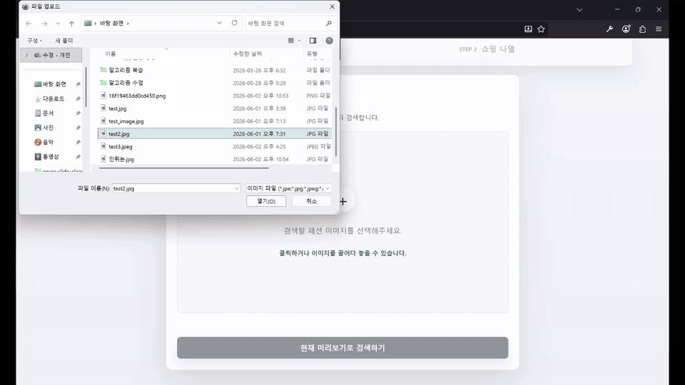
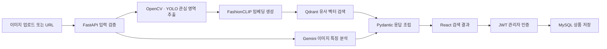

# 패션 이미지 유사도 검색 서비스

이미지 업로드부터 전처리, 임베딩 생성, 벡터 검색, 상품 저장까지 하나의 요청 흐름으로 연결한 **FastAPI 기반 패션 검색 서비스**.

백엔드는 이미지와 URL 입력을 검증하고 OpenCV·YOLO, FashionCLIP, Qdrant, Gemini를 서비스 계층으로 분리해 호출한다. 검색 결과 저장 기능은 JWT 인증과 MySQL을 사용하며, 전체 애플리케이션은 Docker Compose로 함께 실행할 수 있다.

<p align="center">
  
</p>

## 프로젝트가 시작된 배경

> 2026년 6월 디지털영상처리 개인 과제로 시작했으며, 종강 후인 현재도 보강 중인 프로젝트다.

수업 과제는 기술을 복잡하게 쌓는 것보다 디지털영상처리를 이용해 실제로 쓸 만한 결과물을 만드는 것을 중요하게 평가했다. 주제를 고민하던 중 당시 여자친구와 패션 이야기를 나누다가, 사진 속 옷과 비슷한 상품을 바로 찾는 쇼핑몰이라는 아이디어가 나왔다. 사진에서 의류 영역을 분리하고 비슷한 상품을 비교하는 과정은 OpenCV를 실용적으로 적용하기에도 적합했다.

처음에는 쿠팡이나 무신사 같은 쇼핑 플랫폼의 상품을 사용하려 했지만, 이미지와 상품 URL을 계속 수집하고 변경된 데이터를 다시 벡터화해야 하는 방식은 개인 과제로 유지하기 어려웠다. 대신 네이버 쇼핑 API에서 상품명·이미지·가격·판매처·URL을 함께 받고, OpenCV로 의류 영역을 확인한 뒤 FashionCLIP 벡터와 상품 정보를 Qdrant에 저장하는 데이터 구축 프로그램을 만들었다.

과제 결과를 본 교수님은 2학기 졸업작품으로 전시해 볼 것을 제안했다. 이후 README와 시연 자료를 백엔드 요청 흐름 중심으로 다시 정리했으며, 과제로 만든 결과물을 한 번의 시연으로 끝내지 않기 위한 보강 작업을 계속하고 있다.

자세한 기획 배경과 개발 과정은 [과제로 만든 패션 유사도 검색, 종강 뒤에도 고치는 중](https://cora1022.com/blog/posts/opencv-fashion-similarity-search.html)에서 확인할 수 있다.

## 서비스 링크

- 웹 서비스: [coran1022.com](https://coran1022.com)
- API 상태 확인: [coran1022.com/health](https://coran1022.com/health)

## 백엔드가 담당하는 흐름



1. FastAPI가 업로드 형식과 검색 옵션을 검증한다.
2. 업로드 검색은 설정에 따라 OpenCV·YOLO로 의류 관심 영역을 추출한다.
3. FashionCLIP이 이미지를 정규화된 임베딩 벡터로 변환한다.
4. Qdrant가 코사인 유사도 기반 상품 후보를 반환한다.
5. Gemini가 색상, 소재, 패턴, 스타일 키워드를 별도로 분석한다.
6. Pydantic 스키마가 검색 결과와 이미지 특징을 하나의 응답으로 조립한다.
7. 인증된 관리자는 선택한 상품을 MySQL에 저장하거나 삭제할 수 있다.

Gemini API 키가 없거나 특징 분석이 실패해도 벡터 검색 결과는 유지된다. 이미지 특징만 `available: false`로 반환해 검색 기능과 외부 AI 호출의 장애 범위를 분리했다.

## 백엔드 구조

```text
backend/
├─ app/
│  ├─ api/          # 인증, 저장 상품 라우터와 의존성
│  ├─ core/         # 환경 설정, JWT·bcrypt 보안
│  ├─ db/           # SQLAlchemy 엔진과 세션
│  ├─ models/       # 관리자, 저장 상품 테이블
│  ├─ schemas/      # 요청·응답 Pydantic 모델
│  ├─ services/     # OpenCV, FashionCLIP, Qdrant, Gemini
│  └─ main.py       # 앱 수명주기와 검색·크롭 API
├─ models/          # YOLO 의류 탐지 모델
└─ scripts/         # 관리자 생성, Qdrant 데이터 구축
```

FastAPI 시작 시 SQLAlchemy 테이블과 관리자 계정을 준비하고, FashionCLIP과 이미지 탐지 모델을 한 번만 로드해 `app.state`에서 재사용한다. 라우터는 HTTP 입력과 오류 응답을 담당하고, 모델 추론과 외부 저장소 접근은 각각의 서비스 클래스로 분리했다.

## 주요 API

| Method | Endpoint | 역할 | 인증 |
|---|---|---|---|
| `GET` | `/health` | DB, 모델, Qdrant 컬렉션 설정 상태 확인 | 없음 |
| `POST` | `/api/search/image` | 업로드 이미지 크롭·임베딩·유사 상품 검색 | 없음 |
| `POST` | `/api/search/image-url` | 외부 이미지 URL 다운로드 후 유사 상품 검색 | 없음 |
| `POST` | `/api/crop/image` | 관심 영역 크롭 이미지와 좌표 메타데이터 반환 | 없음 |
| `POST` | `/api/auth/login` | 관리자 로그인과 JWT 발급 | 없음 |
| `GET` | `/api/auth/me` | 현재 관리자 정보 조회 | Bearer JWT |
| `GET` | `/api/saved-fashions` | 저장된 패션 상품 목록 조회 | 없음 |
| `POST` | `/api/saved-fashions` | 검색 결과 저장과 중복 방지 | Bearer JWT |
| `DELETE` | `/api/saved-fashions/{id}` | 저장 상품 삭제 | Bearer JWT |

### 이미지 검색 요청

```bash
curl -X POST \
  "http://localhost/api/search/image?top_k=5&crop=true" \
  -F "file=@sample.jpg"
```

`top_k`는 1~20 범위로 제한된다. `crop=true`이면 관심 영역을 먼저 추출하고, 탐지 결과가 없으면 원본 이미지를 그대로 사용한다.

## 데이터와 인증

### Qdrant

FashionCLIP 이미지 벡터와 상품 메타데이터를 저장한다. 검색 결과에는 상품명, 쇼핑몰, 가격, 링크, 상품 ID, 크롭 여부, 임베딩 모델 정보가 함께 포함된다.

검색 API를 사용하려면 `naver_fashion_images_fashionclip` 컬렉션이 먼저 준비돼야 한다. 데이터 구축 스크립트는 네이버 쇼핑 API 결과를 불러와 중복을 확인하고, 의류 영역 검토와 FashionCLIP 임베딩 생성을 거쳐 Qdrant에 저장한다.

```bash
python backend/scripts/naver_crop_to_qdrant_fashionclip.py "스트릿 맨투맨" --display 20
```

### MySQL

- `admin_users`: 관리자 ID, 표시 이름, bcrypt 비밀번호 해시
- `saved_fashions`: 저장한 상품 정보, 유사도 점수, 저장 관리자, 생성 시각

같은 관리자가 동일한 `product_id` 또는 상품 링크를 다시 저장하면 기존 데이터를 반환해 중복 생성을 막는다.

### JWT 인증

로그인 성공 시 만료 시간이 포함된 Bearer 토큰을 발급한다. 보호된 API는 토큰을 해석한 뒤 DB에서 관리자가 실제로 존재하는지 다시 확인한다.

## OpenCV의 역할

OpenCV는 전체 애플리케이션 중 **검색 품질을 보완하는 이미지 전처리 계층**으로 사용한다.

- PIL 이미지를 NumPy 배열로 바꾸고 RGB를 BGR로 변환
- YOLO 의류 탐지 모델을 우선 사용
- 모델이 없으면 OpenCV Cascade 또는 HOG 사람 탐지기로 대체
- 탐지 박스에 여백을 추가하고 이미지 경계 안으로 좌표 보정
- 크롭 적용 여부, 탐지기 종류, 원본 크기, 크롭 좌표를 응답 헤더로 제공

세부 전처리 구현은 [OpenCV 파이프라인 문서](./docs/OPENCV_CORE_PIPELINE.md)에서 확인할 수 있다.

## 실행 환경

| 영역 | 구성 |
|---|---|
| Backend | Python 3.12, FastAPI, Uvicorn, Pydantic |
| Authentication | PyJWT, bcrypt |
| Database | MySQL 8, SQLAlchemy, PyMySQL |
| Vector Search | Qdrant, FashionCLIP, PyTorch, Transformers |
| Image Processing | OpenCV, Ultralytics YOLO, Pillow |
| Feature Analysis | Gemini API |
| Frontend | React, TypeScript, Vite, Nginx |
| Infrastructure | Docker Compose, Caddy |

## Docker Compose로 실행

### 1. 환경 변수 준비

```powershell
Copy-Item .env.example .env
```

`.env`에서 MySQL 비밀번호, JWT 비밀 키, 관리자 계정, 외부 API 키를 설정한다. 운영 환경에서는 예시 기본값을 그대로 사용하지 않는다.

관리자 비밀번호 해시는 다음 명령으로 만들 수 있다.

```bash
python -c "from backend.app.core.security import hash_password; print(hash_password('your-password'))"
```

생성한 값은 `.env`의 `ADMIN_USERS=username:display_name:bcrypt_hash` 형식으로 등록한다.

### 2. 전체 서비스 시작

```bash
docker compose up -d --build
```

Compose가 다음 서비스를 함께 실행한다.

- Caddy: HTTPS 인증서와 외부 요청 진입점
- Nginx + React: 정적 프런트엔드와 `/api` 역방향 프록시
- FastAPI: 검색, 인증, 저장 API
- Qdrant: 임베딩 벡터 검색
- MySQL: 관리자와 저장 상품 데이터

### 3. 상태 확인

```bash
curl http://localhost/health
```

## 설계 포인트

- 무거운 모델은 요청마다 다시 만들지 않고 앱 시작 시 로드해 재사용
- HTTP 처리, 추론, 벡터 검색, DB 접근을 분리해 변경 범위 최소화
- 외부 이미지 다운로드 크기를 12MB로 제한하고 콘텐츠 타입 검증
- Qdrant 연결·컬렉션 누락·잘못된 이미지 오류를 구분해 API 상태 코드로 변환
- bcrypt 해시와 만료형 JWT로 관리자 저장 기능 보호
- Caddy → Nginx → FastAPI 구조로 TLS와 정적 파일, API 역할 분리
